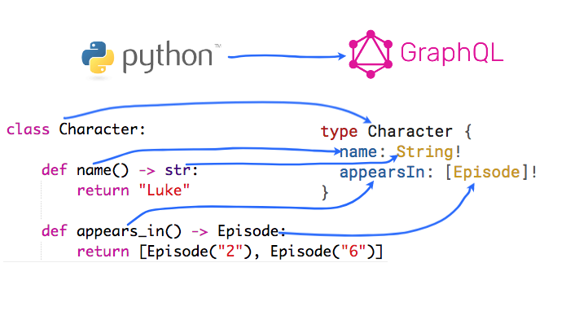

.. _quickstart:

.. highlight:: python

Quickstart Guide
================

This quickstart guide is a brief overview of some of ObjectQL's features, just to get you started.

For a full breakdown of each feature please refer to the **individual docs** (in the table of contents), or for specific implementation details check out the **API docs**.

What is ObjectQL
----------------

ObjectQL is a framework to help build a GraphQL server with Python. Before getting started it's recommended that you have a good understanding of `GraphQL <https://graphql.org/learn/>`_.

ObjectQL can build a **GraphQL schema** directly from **Python classes**.



    Each part of a Python class gets mapped to part of a GraphQL object type.

Installation
------------

ObjectQL requires **Python 3.5** or newer.

Install ObjectQL first::

    pip install objectql


Creating a basic Schema
-----------------------

A **Schema** is used to describe a **GraphQL API**. ObjectQL uses Python classes to create this **Schema**.

To get started we will create a very simple Python class:

.. code-block:: python
    :name: hello-py

    class HelloObjectQL:

        def hello(self, name):
            return "hello " + name + "!"

``HelloObjectQL`` is a typical Python class, and obviously we could use this just like any regular class:

.. code-block:: python

    hello_instance = HelloObjectQL()

    print(hello_instance.hello("rob"))

    >>> hello rob!

But we need to slightly change ``HelloObjectQL`` to make it suitable for creating a **Schema**:

.. code-block:: python
    :caption: hello.py
    :name: hello-py
    :emphasize-lines: 1,3,5,8

    from objectql import ObjectQLSchema

    schema = ObjectQLSchema()

    @schema.root
    class HelloObjectQL:

        @schema.query
        def hello(self, name: str) -> str:
            return "hello " + name + "!"

What was changed?:

- An ``ObjectQLSchema`` object was created.

- The ``@schema.query`` `decorator <https://realpython.com/primer-on-python-decorators/>`_ was imported and added. This labels the ``hello`` method as queryable via GraphQL.

- `Typehints <https://mypy.readthedocs.io/en/latest/cheat_sheet_py3.html>`_ were added to the ``hello`` method arguments and return type. This tells ObjectQL what types it should expect.

|

.. code-block:: python
    :emphasize-lines: 12

    from objectql import ObjectQLSchema

    schema = ObjectQLSchema()

    @schema.root
    class HelloObjectQL:

        @schema.query
        def hello(self, name: str) -> str:
            return "hello " + name + "!"

    executor = schema.executor()

|
Now we can run a GraphQL query on the ``ObjectQLExecutor``:

.. code-block:: python
    :emphasize-lines: 14, 15

    from objectql import ObjectQLSchema

    schema = ObjectQLSchema()

    @schema.root
    class HelloObjectQL:

        @schema.query
        def hello(self, name: str) -> str:
            return "hello " + name + "!"

    executor = schema.executor()

    test_query = '{ hello(name: "rob") }'
    print(executor.execute(test_query))

|
Executing ``hello.py`` in Python results in::

    $ python hello.py
    >>> { "hello": "hello rob!" }


So to recap:

- Python classes are mapped directly to GraphQL types.

- Any instance method on a Python class that is labeled with a ``@schema.query`` (or ``@schema.mutation``) decorator is mapped to a field on the **Schema**.

- The `typehints <https://mypy.readthedocs.io/en/latest/cheat_sheet_py3.html>`_ on methods are mapped to field arguments and return types in the **Schema**.

- A Python class gets mapped to the **Root type** of a **Schema**.

- The **Schema** is then used to create a ``ObjectQLExecutor``.


Types
-----

Type Mapping
````````````

ObjectQL maps Python types directly to the equivalent GraphQL types.

This means you **must** specify all the type hints for any methods that are marked with the ``@schema.query`` (or ``@schema.mutation``) decorator. If a type hint is not specified then that argument will be ignored.

Here are *some* of the types that ObjectQL can map:

+-------------------+--------------------+
| Python Type       | GraphQL Type       |
+===================+====================+
| int               | Int                |
+-------------------+--------------------+
| float             | Float              |
+-------------------+--------------------+
| str               | String             |
+-------------------+--------------------+
| bool              | Boolean            |
+-------------------+--------------------+
| Class             | Object             |
+-------------------+--------------------+
| Enum              | Enum               |
+-------------------+--------------------+
| UUID              | UUID               |
+-------------------+--------------------+
| datetime          | DateTime           |
+-------------------+--------------------+
| NoneType          | null               |
+-------------------+--------------------+
| dict, list        | JSON               |
+-------------------+--------------------+

Type names
``````````

Python and GraphQL are slightly different with their naming conventions.


- Python uses *snake_case* for method names, eg ``this_is_a_method_name``

- GraphQL uses *camelCase* for field names, eg ``thisIsAFieldName``


Because of these different naming conventions; when a class or enum is mapped to a GraphQL type - all the type names get converted to *camelCase*.

For example a method named ``add_user`` is converted to ``addUser``.


Queries and Mutations
`````````````````````

GraphQL **Queries** and **Mutations** are separate types. This is am important distinction because queries can be run in parallel, whereas mutations must always run sequentially.

    ObjectQL uses a single Python class to build both the **Query** and **Mutation** GraphQL types, the fields are separated out when the schema is generated.

For example a single class (with both queryable and mutable fields)::

    from objectql import ObjectQLSchema

    schema = ObjectQLSchema()

    @schema.root
    class Example:

        @schema.query
        def example_query_field() -> str:
            return "query complete"

        @schema.mutation
        def example_mutable_field() -> str:
            # do something with the database
            return "mutation complete"

Will get mapped to two types in the **Schema**::

    type Example {
        exampleQueryField: str!
    }

    type ExampleMutable {
        exampleMutableField: str!
    }


In order to avoid any naming conflicts, any mutable types get the **Mutable** suffix added to their name (for example see **ExampleMutable** above).


Type Modifiers
``````````````

**Modifiers** are used in GraphQL to indicate *Non-Null* type or a *List* of a certain type.

In ObjectQL this is done using `typehints <https://mypy.readthedocs.io/en/latest/cheat_sheet_py3.html>`_, for example:

.. code-block:: python
   :emphasize-lines: 6,10

    from objectql import ObjectQLSchema

    schema = ObjectQLSchema()

    class ExampleModifiers:

    @schema.query
    def example_list() -> List[str]:
        return ["hello", "world"]

    @schema.mutation
    def example_nullable() -> Optional[str]:
        return None

Is mapped to:

.. code-block:: python
   :emphasize-lines: 3,5

    type ExampleModifiers {

        exampleList: [String]!

        exampleNullable: String

    }

+--------------------+---------------------+-------------------------+
| Python Return Type | GraphQL Return Type | Meaning                 |
+====================+=====================+=========================+
| List[str]          | [String]!           | Non-null List of Strings|
+--------------------+---------------------+-------------------------+
| Optional[str]      | String              | Nullable String         |
+--------------------+---------------------+-------------------------+


Object Type
-----------

In GraphQL a field on an **Object** can either return a **Scalar** value, or another **Object**.

Similarly with Python, a method can either return a **Scalar** value, or another **Object**.

Here is an example::

    # note: the methods are not implemented here

    from objectql import ObjectQLSchema

    schema = ObjectQLSchema()

    @schema.root
    class Folder:

        @schema.query
        def name() -> str:
            pass

        @schema.query
        def children(self) -> List[Folder]:
            pass


Notice that the ``children`` method returns a list of ``Folders``.

A GraphQL query for the **Schema** from this class might look like this::

    {
        name
        children {
            name
            children {
                name
            }
        }
    }


By combining multiple classes together, this nesting pattern can be used to build up more complex **Schemas**.

For example here is a set of Python classes that will produce a **Schema** for a comments system::

    # note: the methods are not implemented here

    from objectql import ObjectQLSchema

    schema = ObjectQLSchema()

    class User:

        @schema.query
        def id() -> int:
            pass

        @schema.query
        def name() -> str:
            pass

    class Comment:

        @schema.query
        def message() -> str:
            pass

        @schema.query
        def author() -> User:
            pass

    @schema.root
    class MainController:

        @schema.query
        def users() -> List[User]:
            pass

        @schema,query
        def comments() -> List[Comments]:
            pass

The ``Controller`` suffix (seen above in the ``MainController`` class), is a good *optional* convention to adopt. It can be used to identify that a class manages other classes/models.


HTTP
----

Once you've built your **Schema**, you'll probably want to make it accessible over the internet through a webserver.

The ObjectQL library *does not* have a built in webserver, but the **Schema** that ObjectQL produces is identical to the **Schema** used in other Python GraphQL frameworks.
This means that we can use existing HTTP GraphQL tools with the **Schema** to create a web server.

Here are some examples with some popular web frameworks.


Werkzeug
````````

One of the simplest ways to serve a **Schema** is with ``Werkzeug`` and `werkzeug-graphql <https://gitlab.com/kiwi-ninja/werkzeug-graphql>`_::

    from werkzeug_graphql import GraphQLAdapter

    from objectql import ObjectQLSchema

    schema = ObjectQLSchema()

    @schema.root
    class HelloWorld:

        @schema.query
        def hello(self) -> str:
            return "Hello World!"

    adapter = GraphQLAdapter.from_schema(schema=schema)

    if __name__ == "__main__":
        adapter.run_app()

Flask
`````

If you are using ``Flask`` you could use `flask-graphql <https://github.com/graphql-python/flask-graphql>`_::

    from flask import Flask
    from flask_graphql import GraphQLView

    from objectql import ObjectQLSchema

    app = Flask(__name__)

    class HelloWorld:

        @schema.query
        def hello(self) -> str:
            return "Hello World!"

    graphql_schema, _, root_value = schema.graphql_schema()
    root_value = HelloWorld()

    app.add_url_rule('/graphql', view_func=GraphQLView.as_view('graphql', schema=graphql_schema, root_value=root_value, graphiql=True))

    if __name__ == "__main__":
        app.run()
