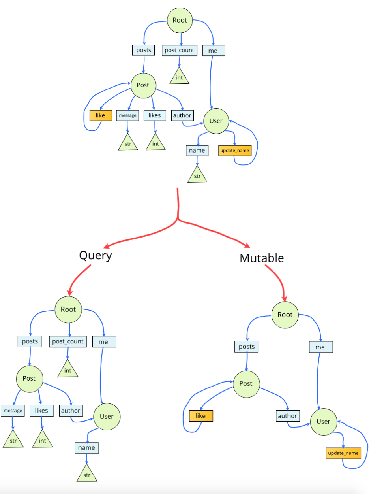

.. _schemas:

.. highlight:: python

Building Schemas
================

    A GraphQL **schema** defines a set of **types** which completely describe the set of possible data you can query.
    Then, when queries come in, they are validated and executed against that **schema**.

ObjectQL can build an entire GraphQL **schema** from Python classes.

.. figure:: images/python_to_graphql.png
    :align: center

    Each part of a Python class gets mapped to part of a GraphQL object type.

This works because the *object/fields* pattern in GraphQL is very similar to the *object/methods* pattern in Python.

In practise, a Python class needs some **additional information** to map to a GraphQL type, which we will go through in this guide.

Building a Schema
-----------------

Root Type
`````````
A schema must always have a **Root type** (often called the *Query type*).
The **Root type** sits at the top level of the schema and acts an an entry point for all queries.

For example:

.. code-block:: python
    :emphasize-lines: 3, 11

        from objectql import query

        class Human:

            @query
            def name(self) -> str:
                "Tom"

        tom = Human(name="Tom")

        class Root:

            @query
            def hello_world(self) -> str:
                return "Hello world!"

            @query
            def a_person(self) -> Human:
                return tom

In the example we have defined two classes, ``Human`` and ``Root``.

Building a schema from classes can be quite complex, so a helper class called the ``ObjectQLSchemaBuilder`` manages this process.

The **Root type** is passed as the *root* argument to the ``ObjectQLSchemaBuilder``, to create a schema builder:

.. code-block:: python
    :emphasize-lines: 21, 23

    from objectql import query, ObjectQLSchemaBuilder

    class Human:

        @query
        def name(self) -> str:
            "Tom"

    tom = Human(name="Tom")

    class ExampleRoot:

        @query
        def hello_world(self) -> str:
            return "Hello world!"

        @query
        def a_person(self) -> Human:
            return tom

    schema_builder = ObjectQLSchemaBuilder(root=ExampleRoot)

    schema, _, _ = schema_builder.schema()


Then the ``.schema()`` method is called to get the ``schema``.

Only one class (the **Root type**) gets passed to the ``ObjectQLSchemaBuilder`` because child object types (such as the ``Human`` object type) will be discovered by the ``ObjectQLSchemaBuilder`` at runtime.
This works as long as all the type hints have been specified.

Root value
``````````

Every GraphQL server has a **Root value** at the top level. The **Root value** is the entry object that all queries will pass through.

The **Root value** can be created in two ways:

1. If a Python **class** is passed as the *root* argument to the ``ObjectQLSchemaBuilder``:

    The constructor of the given Python **class** is the **Root type** and will be called with no arguments to create a **Root value**.

2. If a Python **object** is passed as the *root* argument to the ``ObjectQLSchemaBuilder``:

    The Python **object** is the **Root value** and the objects class is the **Root type**.

Although the 2nd option involves an extra step, it gives complete control in constructing the **Root value**.
This could be used to pass arguments during initialization of the **Root value**.

Method Decorators
-----------------

Classes will often have functionality that shouldn't exposed in the GraphQL schema.

To handle this, only methods that are labeled with specific `decorators <https://realpython.com/primer-on-python-decorators/>`_ are mapped.

There are 2 decorators available that can label methods.

    - ``@query``
    - ``@mutation``

Query
`````

The ``@query`` decorator is used to label a **method** that should be exposed as a **query** field on the GraphQL schema, for example:

.. code-block:: python
    :linenos:
    :emphasize-lines: 5

    from objectql import query

    class ExampleQueryDecorator:

        @query
        def hello(self, name: str) -> str:
            return self.hidden_hello(name)

        def hidden_hello(self, name: str) -> str:
            return "hello " + name + "!"

In the above example (when mapped to a schema) the *hello* **method** will be exposed as a field on the ``ExampleQueryDecorator`` GraphQL object type.

In contrast, the *hidden_hello* **method** wont be exposed on the schema. Although the *hidden_hello* method could still be called from Python, for example above on **line 7** (inside the *hello* **method**).


Mutation
````````

The ``@mutation`` decorator is almost identical to the ``@query`` decorator, except it labels a **method** that should be exposed as a **mutation** field on the GraphQL schema.

The ``@mutation`` decorator should only be used on **methods** that mutate or modify data.

|

    Its **very important** to only use the ``@query`` decorator for **methods** that fetch data and the ``@mutation`` decorator for
    **methods** that mutate data. The reasons why are explained in the **Schema Filtering** section below.

|

Class Decorators
----------------

There are 2 additional decorators that are used to label classes.

    - ``@interface``
    - ``@abstract``

Interface
`````````

The ``@interface`` decorator can be used on a **class** to create a GraphQL interface type (instead of an object type).

The interface functionality closely mirrors `GraphQL interfaces <http://graphql.github.io/learn/schema/#interfaces>`_.

For example the ``@interface`` decorator is being used here:

.. code-block:: python

    from objectql import query, interface

    @interface
    class Animal:

        @query
        def name(self) -> str:
            return "John Doe"

    class Human(Animal):

        @query
        def name(self) -> str:
            return "Thomas"

        @query
        def social_security_number(self) -> str:
            return "111-11-1111"

    class Dog(Animal):

        @query
        def name(self, name: str) -> str:
            return "Spot"

        @query
        def favourite_toy(self) -> str:
            return "Ball"

In the above example, the ``Animal`` interface is implemented by both the ``Human`` and ``Dog``, so they all share the ``name`` field.

This example would map to these types in the schema::

    interface Animal {
        name: String!
    }

    type Human implements Animal {
        socialSecurityNumber: String!
    }

    type Dog implements Animal {
        favouriteToy: String!
    }


Its also worth noting that if the ``Human`` or ``Dog`` class above didn't implement the ``name`` method,
then class inheritance would kick in and the ``name`` method on ``Animal`` would still get called.

Abstract
````````

The ``@abstract`` decorator can be used to indicate that a **class** should not be mapped by ObjectQL.

GraphQL does not support type *inheritance* (only `interfaces <http://graphql.github.io/learn/schema/#interfaces>`_)
so ``@abstract`` allows us to still use class *inheritance* in Python.

For example:

.. code-block:: python

    from objectql import query, abstract

    @abstract
    class Animal:

        @query
        def age(self) -> int:
            25

    @abstract
    class Human(Animal):

        @query
        def social_security_number(self) -> str:
            return "111-11-1111"

    class Student(Human):

        @query
        def college(self) -> str:
            return "Exeter"

``Animal`` and ``Human`` are marked as ``@abstract`` (they are ignored), so the above example would map to just one type in the schema::

    type Student {
        age: Int!
        socialSecurityNumber: String!
        college: String!
    }

The methods from the parent classes (``Animal`` and ``Human``) are still reflected in the schema on the ``Student`` type.

Metadata
--------

`Decorators <https://realpython.com/primer-on-python-decorators/>`_ are also used to attach **metadata** to a class or method.

The **metadata** is a dictionary that can specify *addition configuration* for the corresponding class or method, for example:

.. code-block:: python
    :emphasize-lines: 5,6,7,8,9,10

    from objectql import query

    class Hello:

        @query({
            "custom_dict_key": {
                "hello": "here is custom metadata",
            },
            "custom_value_key": 42
        })
        def hello(self, name: str) -> str:
            return "hey"

When resolving a query, a fields **metadata** can be accessed through the **context**.

There are some **metadata** keys that are reserved for used by ObjectQL:

- ``RESOLVE_TO_MUTABLE``
- ``RESOLVE_TO_SELF``
- ``NATIVE_MIDDLEWARE``

Schema Filtering
----------------

A GraphQL service *normally* has two separate schemas with two separate **Root types**; one for **fetching data**, and another for **updating data**.

This is because **data fetches** can be run in parallel, whereas **data updates** must always run sequentially.

ObjectQL uses just one **Root class**, and the ``@query`` and ``@mutation`` decorators are used to filter the fields into two **Root types**.

Here is an example to see exactly how the **Root class** gets mapped into two **Root types**:

.. code-block:: python

    from objectql import query, mutation

    class User:

        @query
        def name(self) -> str:
            pass

        @query
        def update_name(self) -> 'User':
            pass


    class Post:

        @mutation
        def like(self) -> Post:
            pass

        @query
        def message(self) -> str:
            pass

        @query
        def likes(self) -> int:
            pass

        @query
        def author(self) -> User:
            pass


    class Root:

        @query
        def posts(self) -> List[Post]:
            pass

        @query
        def post_count(self) -> int:
            pass

        @query
        def me(self) -> User:
            pass


Lets walk through the main features of these classes:

- There are two models; ``User`` and ``Post``, as well as a **Root class** called ``Root``.

- The **Root class** (``Root``) has methods that return to all the *posts*, the *count of the posts* and the *current user* (the ``posts``, ``post_count`` and ``me`` methods).

- The ``Post`` class has methods that return the *author*, the *message* and the number of *likes*.

- A ``Post`` can be *liked* with the ``like`` method.

- The ``User`` class has a method to returns the users *name*.

- A ``Users`` name can be *updated* with the ``update_name`` method.


When built into a schema, these classes will map to a set of **Query** types and a set of **Mutable** types:



    The ``green`` shapes are *types*, the ``blue`` shapes are **query** *fields* and the ``orange`` shapes are **mutable** *fields*

The above example as a GraphQL schema would look like this:

.. code-block::
    :linenos:

    type Root {
        posts: [Post]!
        postCount: Int!
        me: User!
    }

    type Post {
        message: String!
        likes: Int!
        author: User!
    }

    type User {
        name: String!
    }


    type RootMutable {
        posts: [PostMutable]!
        me: UserMutable!
    }

    type PostMutable {
        like: Post!
    }

    type UserMutable {
        updateName: User!
    }

These rules were followed to create the two types and filter the fields:

1. Each ``Query`` type is duplicated to create a ``Mutable`` type, which is suffixed with ``Mutable``.
2. All ``@mutable`` fields are removed from all ``Query`` types.
3. Any ``@query`` fields that never lead to a ``Mutable`` type are removed from the ``Mutable`` types.

After the above rules are applied there are a few things worth noting:

- **Line 18:** Any ``@query`` fields that still remain on a ``Mutable`` type will always return a ``Mutable`` type.

|

- **Line 23:** ``@mutable`` fields on a ``Mutable`` type will by default return a ``Query`` type (unless otherwise specified, see *Mutation recursion* below).

Mutation recursion
``````````````````

Middleware
----------


Compatibility
-------------


ObjectQL is actually based on the `GraphQL-core <https://github.com/graphql-python/graphql-core>`_ Python library,
which also powers another popular frontend `Graphene <https://github.com/graphql-python/graphene>`_.

For this reason ObjectQL produces a schema identical to that of Graphene.
